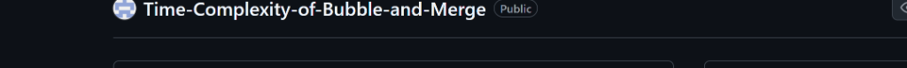

# RRR — Rapid Recursive Rearrangement

<div align="center">
  
  <h2>From Chaos to Order</h2>
  <p>A premium algorithm visualization and analytics platform featuring advanced sorting simulations, race arena, benchmarking, learning center, code studio, and performance analytics.</p>
</div>

---

## 🌟 Project Overview

**RRR (Rapid Recursive Rearrangement)** is not just another simple sorting visualizer. It is a premium interactive telemetry platform designed to look and feel like a modern, venture-backed financial terminal. With a luxurious **Obsidian Black, Champagne Gold, and Titanium Gray** glassmorphism aesthetic, RRR transforms the study of algorithms into a sensory and educational masterpiece.

It decouples mathematical sorting computation from UI rendering by running an event-driven engine in memory to produce a sorting trace (frames). These frames are then played back at high speeds with perfect precision, allowing users to pause, rewind, step-by-step debug, or speed up visualizations with complete fluid control.

---

## ⚡ Features

### 1. Command Center (Dashboard)
* Access all sub-modules from a unified F1-telemetry style status hub.
* Live status tracker showing system uptime, total algorithm count, and simulation counters.

### 2. Sort Lab
* Visualize 10 distinct sorting algorithms (Bubble, Selection, Insertion, Merge, Quick, Heap, Counting, Radix, Bucket, and Shell).
* Choose from 5 different visual styles:
  * ▐ **Bars**: High-fidelity, gradient-accented height visualizer.
  * 🏙 **Skyline**: Luxury F1-telemetry themed glowing bar gradients.
  * ◎ **Circular**: Beautiful polar coordinate vector spikes.
  * ✦ **Particle**: Scatterplot coordinates with connected micro-lines.
  * ⊞ **Matrix**: Interactive numbers grid colored dynamically by complexity density.
* Live running commentary explaining exactly what comparison or swap is occurring.

### 3. Race Arena
* F1-style grid competition matching up to 6 sorting algorithms concurrently on the same dataset.
* Interactive speedometer gauging progress, live ranking telemetry, and live commentators broadcasting the race!

### 4. Performance Analytics Suite
* Run Bloomberg-grade benchmarking test suites against 10 algorithms across multiple array sizes ($N=10 \rightarrow 1000$).
* Dynamic Chart.js line and bar graphs visualizing runtime complexity growth.
* Visual Heatmap highlighting comparison counts to study algorithmic search density.

### 5. Learning Center
* Deep theoretical explanations, step-by-step mechanics, best/worst complexity comparisons, common interviewer traps, and interactive pseudocode highlights.

### 6. Code Studio & Complexity Universe
* 1-click copyable production-ready implementations in 6 languages: Python, JavaScript, TypeScript, Java, C++, and C.
* Interactive Big-O Notation growth comparison chart scaling from constant $O(1)$ to exponential $O(2^n)$.

---

## 🛠 Technology Stack

* **Framework**: React 18 + Vite (Tailwind CSS for luxury utility tokens)
* **Animation & Rendering**: Framer Motion + HTML5 Canvas
* **Charting Engine**: Chart.js + react-chartjs-2
* **Syntax Highlighter**: react-syntax-highlighter (Atom Dark style)
* **Icons**: Lucide React
* **Language**: TypeScript (Strict type checking enabled)

---

## 📦 Installation Guide

To run RRR locally on your machine, you need **Node.js** (v18+) and npm/yarn installed.

```bash
# 1. Clone the repository
git clone https://github.com/anirudhsista2988/Time-Complexity-of-Bubble-and-Merge.git

# 2. Navigate into the project directory
cd Time-Complexity-of-Bubble-and-Merge

# 3. Install the optimized production-grade dependencies
npm install

# 4. Start the development server
npm run dev
```

The application will start running at `http://localhost:5173`. Open your browser to begin exploring!

---

## 🕹 Usage Guide

1. **Simulate a Sorting Run**: Navigate to the **Sort Lab** from the Navbar. Choose an algorithm (e.g. Quick Sort) and select your visualizer mode (e.g. *Skyline* or *Circular*). Use the play/pause buttons, adjust speed sliders, or step frame-by-frame using `Skip Forward` or `Skip Back`.
2. **Race Algorithms**: Head to the **Race Arena**, select the algorithms you want to compete against each other, adjust the dataset size, and click **Start Race** to watch them compete in real-time.
3. **Run Benchmarks**: Go to the **Analytics Terminal**, click **Run Suite** to perform real-time mathematical benchmarking of all algorithms, and interact with the resultant graphs, tables, and heatmaps.
4. **Learn and Code**: Use the **Learning Center** to review theoretical details, and use the **Code Studio** to export verified sorting codes for your own applications.

---

## 🖼 Screenshots

Here is the premium dashboard and visualizer interface in action:



---

## 🚀 Future Roadmap

- [ ] **Multi-Threaded Sorting**: Move sorting trace generation to Web Workers for multi-threaded performance on huge datasets.
- [ ] **Custom Algorithm Sandbox**: Let users write custom JavaScript sorting routines in an interactive editor and visualize them instantly.
- [ ] **Data Distribution Simulations**: Add presets for sorted, reverse-sorted, randomized, and duplicate-heavy arrays to study algorithm resilience.
- [ ] **Audio-Spatialization**: Implement audio pitch-bending mapped to swap and comparison frequencies for stereo-acoustic sorting feedback.

---

## 📜 License

This project is licensed under the MIT License. Feel free to use, modify, and distribute it for educational or production purposes.
